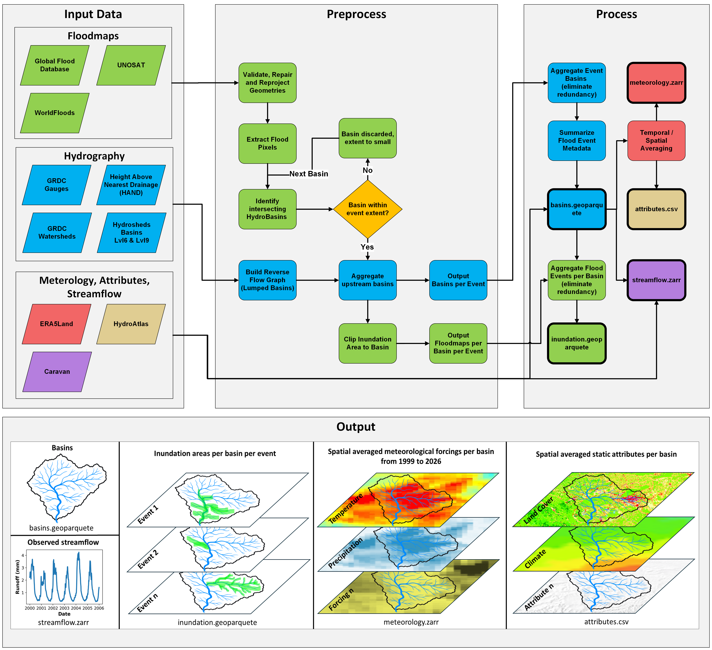

<p align="center">
  
</p>

<p align="center">
  <b>A global, event-linked flood dataset combining inundation mapping with meteorological time series data.</b><br/>
  <sub>Global Flood Database · UNOSAT · <a href="https://github.com/spaceml-org/ml4floods?tab=readme-ov-file">WorldFloods</a> · ERA5-Land · CARAVAN · HydroSHEDS · HydroATLAS</sub>
</p>

<p align="center">
  
  
  
</p>

---

## Overview

**DELUGE** (*Dataset for Event Linked Ungauged and Gauged Environments*) is a
global flood-inundation dataset linked to **HydroBASINS Level-6 & 9**
catchments. It combines three satellite flood-map archives with daily
meteorology, observed streamflow, and static basin attributes so that every
flood event is paired with the hydro-meteorological context of its
contributing basin(s).

| Component | Source | Output |
|-----------|--------|--------|
| Flood maps | Global Flood Database (GFD), UNOSAT, [WorldFloods](https://github.com/spaceml-org/ml4floods?tab=readme-ov-file) | `inundation.geoparquet` |
| Catchments | HydroSHEDS Lvl 6 & 9, GRDC gauges & watersheds, HAND | `basins.geoparquet` |
| Meteorology | ERA5-Land (1999&ndash;2026) | `meteorology.zarr` |
| Streamflow | CARAVAN | `streamflow.zarr` |
| Static attributes | HydroATLAS + Earth Engine | `attributes.csv` |

---

## Workflow

<p align="center">
  
</p>

The pipeline flows left-to-right: **Input Data &rarr; Preprocess &rarr; Process &rarr; Output**.
Each stage is a standalone script; `_run/run_pipeline.py` chains them in order.

---

## Repository layout

```text
github_library/
├── code/
│   ├── download/      Fetch raw source data (GFD, UNOSAT, HAND, ERA5-Land)
│   ├── preprocess/    Merge HydroSHEDS; process flood rasters; link to basins
│   ├── process/
│   │   ├── spatial/       Combine per-event outputs into global GeoParquet
│   │   └── timeseries/    Aggregate ERA5-Land + streamflow per basin (Zarr)
│   ├── validation/    Sanity checks and CARAVAN cross-validation
│   └── analyze/       Plots and summary statistics
│
├── _run/
│   ├── config.yml           Central paths & parameters
│   ├── paths.py             Path helpers
│   ├── run_pipeline.py      End-to-end driver (download stages commented out)
│   └── usage_notes.ipynb    Worked examples on the final outputs
│
└── outputs/           Validation reports and analysis figures
```

---

## Quick start

```bash
# 1. (One-off) download the raw datasets — see each script header for prereqs
python code/download/gfd.py
python code/download/hand_global.py
python code/download/unosat.py
python code/download/era5land.py

# 2. Verify every input path in _run/config.yml exists on disk
python _run/run_pipeline.py --check

# 3. Run the full pipeline end-to-end
python _run/run_pipeline.py
```

> Configure paths inside each script (most use hard-coded input/output paths
> at the top of the file) or edit `_run/run_pipeline.py` to pass different
> arguments.

---

## Pipeline stages

### 1 &middot; Download &nbsp;`code/download/`

Run once per source. Requires external credentials/auth (see script headers).

| # | Script | Purpose | Prerequisite |
|---|--------|---------|--------------|
| 1 | `gfd.py` | Unzip Global Flood Database v1.4 archives | `gsutil -m cp -r gs://gfd_v1_4 download` |
| 2 | `hand_global.py` | Download global 90 m HAND raster from Earth Engine, tile-by-tile, and merge into one GeoTIFF | `earthengine authenticate` |
| 3 | `unosat.py` | Download UNOSAT flood events (shapefiles &rarr; GeoPackages) | `unosat_floodevents_webmap.txt` in cwd |
| 4 | `era5land.py` | Batched ERA5-Land download via Copernicus DataStores, aggregated to daily Zarr | `~/.cdsapirc` |

### 2 &middot; Preprocess &nbsp;`code/preprocess/`

1. **`hydrosheds_merge_continents.py`** &mdash; merges per-continent HydroSHEDS Lvl-9 zips into one global GPKG.
2. **`gfd_InundationProcessor.py`** &mdash; removes permanent water (JRC + HydroLAKES) and applies a HAND filter to GFD TIFs. Output: single-band inundation-only TIFs.
3. **`gfd_InundationBasinLinker.py`** &mdash; links GFD inundated-area TIFs to HydroBASINS catchments (BFS on `NEXT_DOWN` for full upstream catchments). Optional GRDC IoU match.
4. **`unosat_InundationBasinLinker.py`** &mdash; same, for UNOSAT flood-extent GeoPackages.
5. **`worldfloods_InundationBasinLinker.py`** &mdash; same, for [WorldFloods](https://github.com/spaceml-org/ml4floods?tab=readme-ov-file) flood GeoJSONs.

### 3 &middot; Process &mdash; spatial &nbsp;`code/process/spatial/`

1. **`combine_basins.py`** &mdash; merges per-event basin files &rarr; `basins.geoparquet`. Matches basins to CARAVAN gauges by polygon IoU.
2. **`combine_inundation.py`** &mdash; merges per-event inundation files &rarr; `inundation.geoparquet`. Deduplicates and normalises satellite-source names.
3. **`combine_attributes.py`** &mdash; concatenates per-chunk attribute CSVs &rarr; `attributes.csv`. Requires the Caravan Earth Engine notebook (below) to have populated `attributes/`.
4. **`final_filter.py`** &mdash; drops basins whose inundation percentage is below the threshold, recomputes upstream counts, re-densifies `deluge_id`.

> **Manual step (not in `run_pipeline.py`)** &mdash; `Caravan_part1_Earth_Engine_static_attributes.ipynb`
> Google Earth Engine notebook &mdash; run in Colab. Computes static basin
> attributes (topography, land cover, climate, soils) using the basin subsets
> exported by `earthengine_datasplit.py`.

### 4 &middot; Process &mdash; timeseries &nbsp;`code/process/timeseries/`

1. **`earthengine_datasplit.py`** &mdash; simplifies basin geometries and splits `basins.geoparquet` into Earth-Engine-sized shapefile chunks (input for the Caravan notebook).
2. **`aggregate_ERA5Land.py`** &mdash; rasterises basins and computes per-basin daily means from the ERA5-Land Zarr &rarr; `meteorology.zarr`.
3. **`streamflow.py`** &mdash; extracts CARAVAN daily streamflow for basins with a matched `caravan_id` &rarr; `streamflow.zarr`.

### 5 &middot; Validation &nbsp;`code/validation/`

| # | Script | Purpose |
|---|--------|---------|
| 1 | `combine_basins_val.py` | Schema / consistency checks on `basins.geoparquet` |
| 2 | `combine_inundation_val.py` | Schema / consistency checks on `inundation.geoparquet` |
| 3 | `caravan_basins_iou_val.py` | Report CARAVAN &harr; HYBAS matches by IoU |
| 4 | `meteorology_val.py` | Compare DELUGE meteorology to CARAVAN reference |

---

## Outputs

| File | Content |
|------|---------|
| `basins.geoparquet` | HydroBASINS polygons for every event, with upstream aggregation and CARAVAN linkage |
| `inundation.geoparquet` | Flooded-area polygons per basin, per event, per source |
| `meteorology.zarr` | Daily basin-averaged ERA5-Land forcings |
| `streamflow.zarr` | Daily observed streamflow for CARAVAN-linked basins |
| `attributes.csv` | Static basin attributes (topography, land cover, climate, soils) |

See `_run/usage_notes.ipynb` for a worked example of loading and querying these
outputs.
